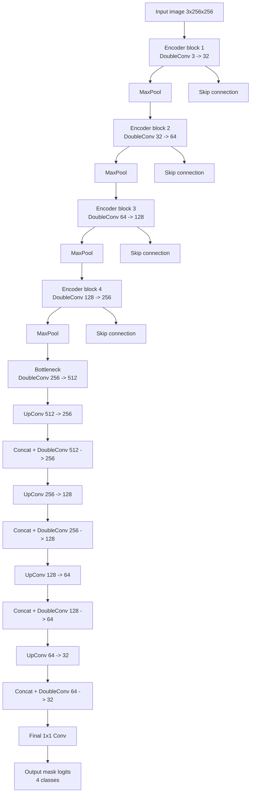
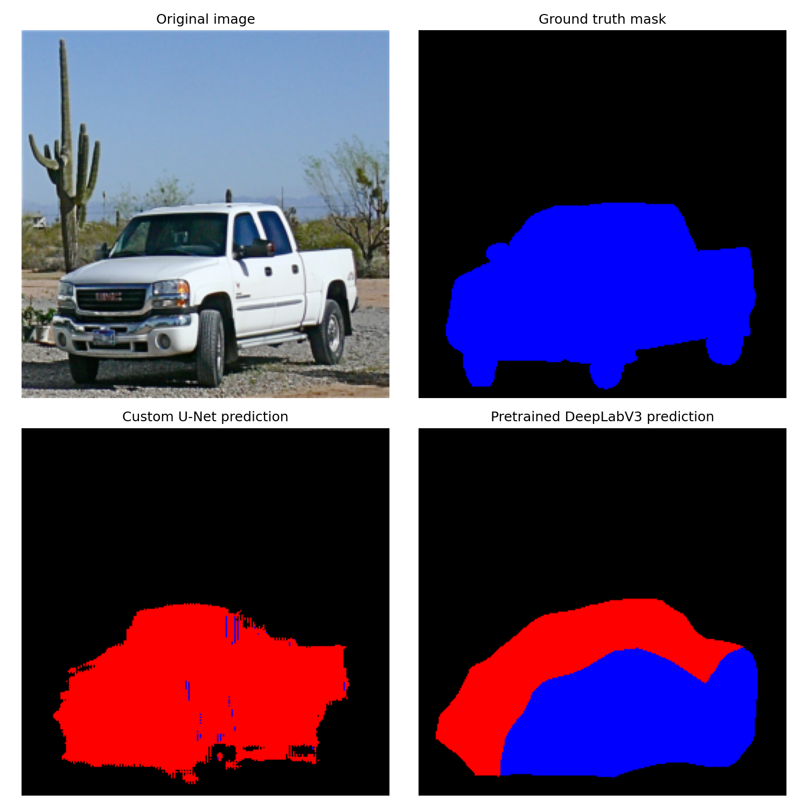

# Vehicle Segmentation (Car / Bus / Truck)

Semantic image segmentation project for Deep Learning course.

The goal is to segment vehicles in images into the following classes:

- 0 - background  
- 1 - car  
- 2 - bus  
- 3 - truck  

---

## Task

Given an input image, predict a pixel-wise segmentation mask for vehicle classes.

The dataset is based on **OpenImages instance segmentation**.

---

## Dataset

Source: [OpenImages V7](https://storage.googleapis.com/openimages/web/index.html)  
Classes:
- Car
- Bus
- Truck

### Data split

- Train: 800 images  
- Validation: 200 images  
- Test: 100 images  

---

## Model 1: Custom U-Net

A lightweight U-Net was implemented and trained from scratch.

### Architecture



---

## Model 2: Pretrained DeepLabV3

A pretrained DeepLabV3-MobileNetV3 model was fine-tuned.

---

## Results

| Model     | Pixel Acc | Car F1 | Bus F1 | Truck F1 | Macro Precision | Macro Recall | Macro F1 |
|-----------|-----------|--------|--------|----------|-----------------|--------------|----------|
| U-Net     | 0.638     | 0.330  | 0.005  | 0.105    | 0.262           | 0.215        | 0.147    |
| DeepLabV3 | 0.712     | 0.519  | 0.659  | 0.555    | 0.507           | 0.743        | 0.578    |

---

## Run

```bash
pip install -r requirements.txt
python src/download_data.py
python src/prepare_index.py
python src/train.py
python src/train_deeplab.py
python src/evaluate.py
python src/evaluate_deeplab.py
python src/visualize_predictions.py
python src/predict_from_url.py "IMAGE_URL_OR_PATH"
```

---

## Example Prediction

Comparison of ground truth, custom U-Net, and pretrained DeepLabV3 on a test image.



---