# Vehicle Segmentation (Car / Bus / Truck)

Semantic image segmentation project for a Deep Learning course.

The goal is to segment vehicles in images into the following classes:

* **0 — background**
* **1 — car**
* **2 — bus**
* **3 — truck**

---

## Task

Given an input image, predict a **pixel-wise segmentation mask** for vehicle classes.

The dataset is based on **OpenImages instance segmentation**.

---

## Dataset

Source: OpenImages V7
https://storage.googleapis.com/openimages/web/index.html

### Classes:

* Car
* Bus
* Truck

### Data split

* **Train:** 2550 (~70%)
* **Validation:** 450 (~13%)
* **Test:** 602 (~17%)

### Pixel distribution

The dataset is highly imbalanced at the pixel level:

- background: **73.7%**
- car: **19.6%**
- bus: **3.4%**
- truck: **3.3%**

This imbalance makes the task challenging:

- background dominates the loss
- smaller classes (bus, truck) are harder to learn
- naive models tend to overpredict background

---

## Training Environment

Training was performed in **Google Colab**:

* GPU: **NVIDIA T4 / L4**
* Framework: PyTorch

---

## Model 1: Custom Res-U-Net

A custom U-Net variant with residual connections was implemented.

### Architecture

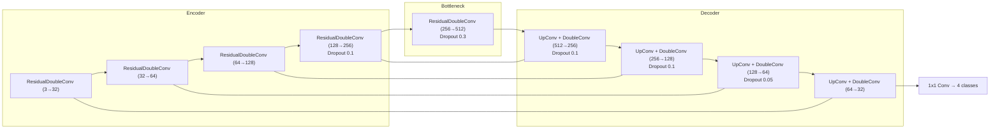

_Notes_:

_The encoder uses residual blocks to improve gradient flow and feature reuse.
The decoder follows a standard U-Net structure with skip connections.
Dropout is applied more aggressively in deeper layers._

---

## Training Strategy

### Loss

Final model uses **Combo Loss**:

- Focal Loss (0.7)
- Dice Loss (0.3)

Focal Loss parameters:
- gamma = 2.0
- alpha = [0.05, 0.20, 1.10, 1.15]

Focal Loss helps address class imbalance, while Dice Loss improves overlap quality.

### Data augmentation

To improve generalization, the following augmentations were applied:

- horizontal flip
- random geometric transformations
- color augmentations

They were applied only to the training set.
While not always improving validation metrics directly, they help reduce overfitting and improve robustness.

### Early stopping

- Monitored metric: **validation macro F1**
- Patience: **10**
- Min delta: **0.0005**

### Learning rate schedule

- Scheduler: **ReduceLROnPlateau**
- Monitored metric: **validation loss**
- Factor: **0.6**
- Patience: **3**
- Min LR: **1e-5**

---

## Evaluation

Metrics are computed focusing on the **vehicle classes**: car, bus, truck.

Background pixels are not included in macro-averaged precision, recall, and F1-score,
which prevents artificially inflated performance due to the dominant background class.
However, background predictions still contribute to false negatives, making the metrics stricter.

Pixel accuracy is computed over all classes.

Confusion matrices are computed only over vehicle pixels (background excluded) and normalized per class.
Therefore, values in the confusion matrix may be higher than the corresponding recall values,
since misclassifications into background are not reflected in the matrix.

---

## Run

```bash
pip install -r requirements.txt
python src/download_data.py
python src/prepare_index.py
python src/train.py
python src/train_deeplab.py
python src/evaluate.py
python src/evaluate_deeplab.py
python src/visualize_predictions.py
python src/predict_from_url.py "IMAGE_URL_OR_PATH"
```

---

## Training Evolution (U-Net)

| #  | Experiment        | Changes                                                   | Macro F1 |
|----|-------------------|-----------------------------------------------------------|----------|
| 1  | Baseline          | U-Net + CrossEntropy, small dataset (~1000)               | 0.15     |
| 3  | Dataset scaling   | + larger dataset (3000 train+val / 602 test) + Focal Loss | 0.41     |
| 5  | + Padding         | Preserve aspect ratio                                     | 0.34     |
| 6  | + Model capacity  | Double channels + dropout + 6 augmentations               | 0.35     |
| 8  | + Class balancing | Revert channels + adjusted alpha weights                  | 0.40     |
| 11 | + Residual blocks | Res-U-Net encoder                                         | 0.44     |
| 12 | + LR scheduler    | ReduceLROnPlateau                                         | 0.44     |
| 13 | + Combo Loss      | Focal (0.7) + Dice (0.3)                                  | **0.52** |
| 14 | + Attention gates | Attention in skip connections                             | 0.48     |
| 16 | Final run         | Best architecture - #13 experiment (stability check)      | 0.50     |

---

## Model 2: DeepLabV3 (Pretrained)

Model: DeepLabV3-MobileNetV3
Source: PyTorch torchvision

https://pytorch.org/vision/main/models/generated/torchvision.models.segmentation.deeplabv3_mobilenet_v3_large.html

### Training strategy

* Pretrained on ImageNet
* Freeze backbone for first **8 epochs**
* Then full fine-tuning

---

## Training Dynamics

### Res-U-Net (#13)

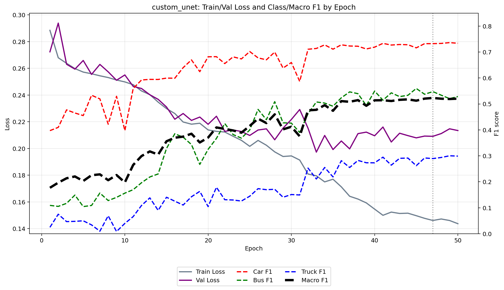

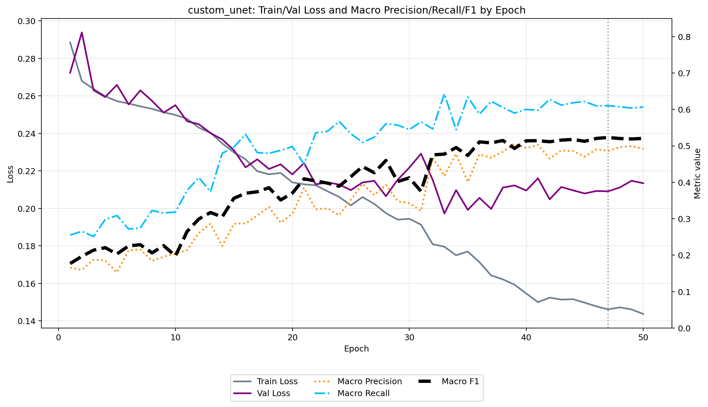

### DeepLabV3

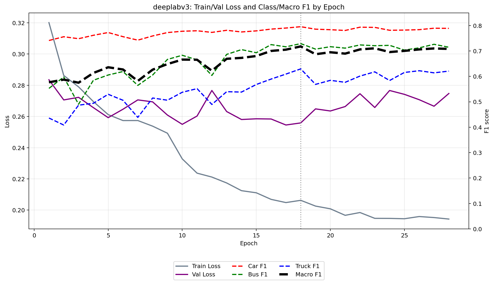

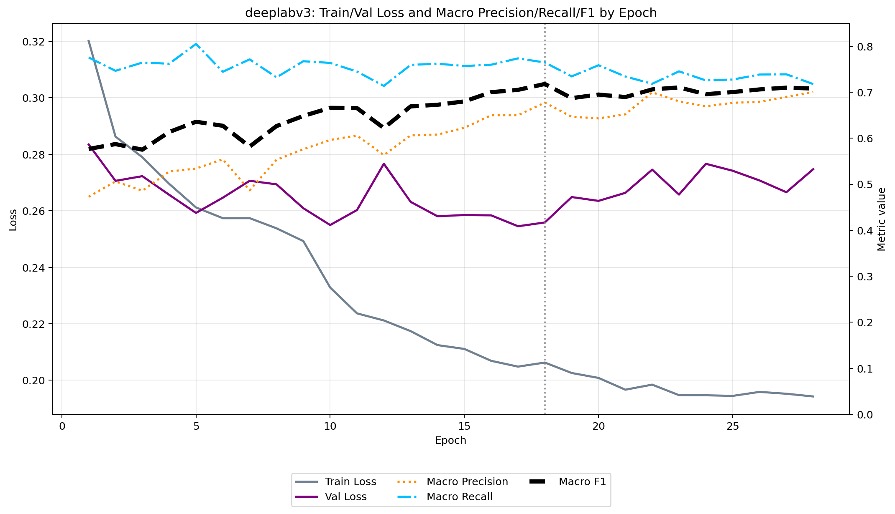

For both models, training loss steadily decreases, while validation loss plateaus after a certain point.
At the same time, macro F1 continues to improve slightly, indicating that class balance is still being refined even after convergence in loss.

This behavior suggests mild overfitting, but early stopping prevents degradation.

---

## Results (Test set)

### Overall metrics

| Model           | Pixel Acc | Macro Precision | Macro Recall | Macro F1 |
|-----------------|-----------|-----------------|--------------|----------|
| U-Net (#3)      | 0.590     | 0.337           | 0.566        | 0.409    |
| Res-U-Net (#13) | 0.787     | 0.511           | 0.642        | 0.521    |
| DeepLabV3       | 0.820     | 0.635           | 0.692        | 0.603    |

---

### Per-class metrics

#### Res-U-Net (#13)

| Class | Precision | Recall | F1    |
|-------|-----------|--------|-------|
| Car   | 0.302     | 0.897  | 0.452 |
| Bus   | 0.692     | 0.665  | 0.678 |
| Truck | 0.539     | 0.363  | 0.434 |

---

#### DeepLabV3

| Class | Precision | Recall | F1    |
|-------|-----------|--------|-------|
| Car   | 0.323     | 0.914  | 0.477 |
| Bus   | 0.849     | 0.724  | 0.782 |
| Truck | 0.733     | 0.439  | 0.549 |

---

### Confusion Matrices

#### Res-U-Net (#13)

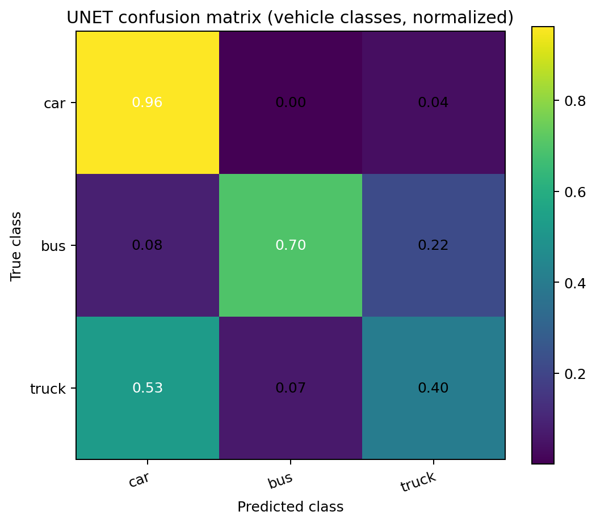

#### DeepLabV3

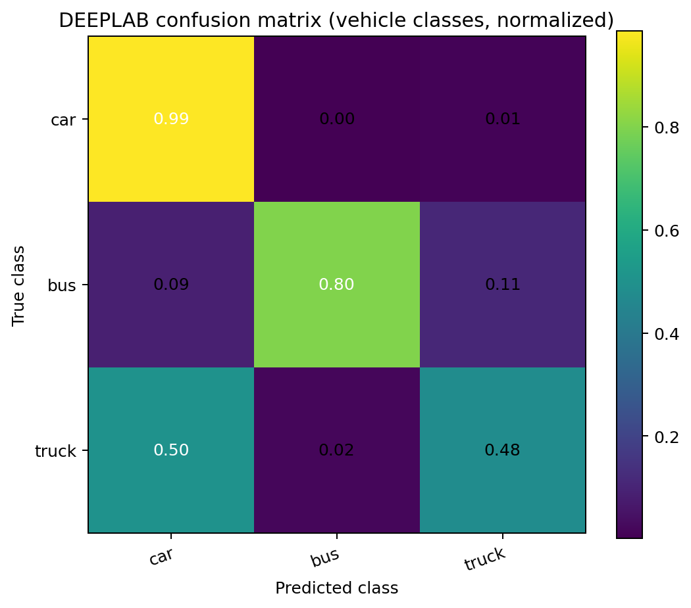

---

## Prediction Examples

### Car

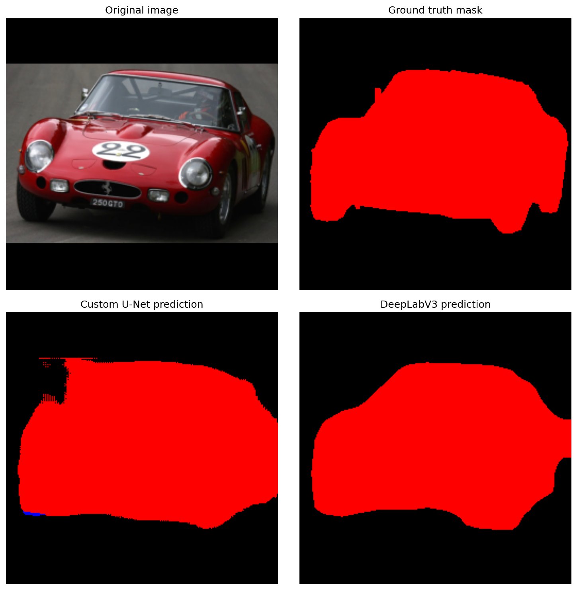

### Bus

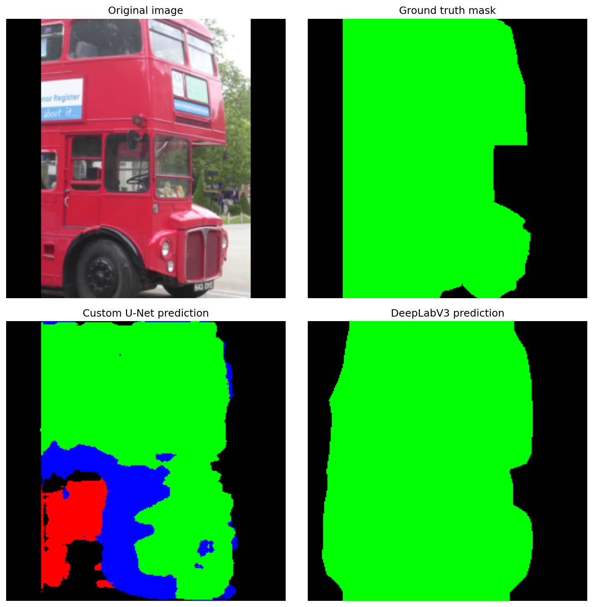

### Truck

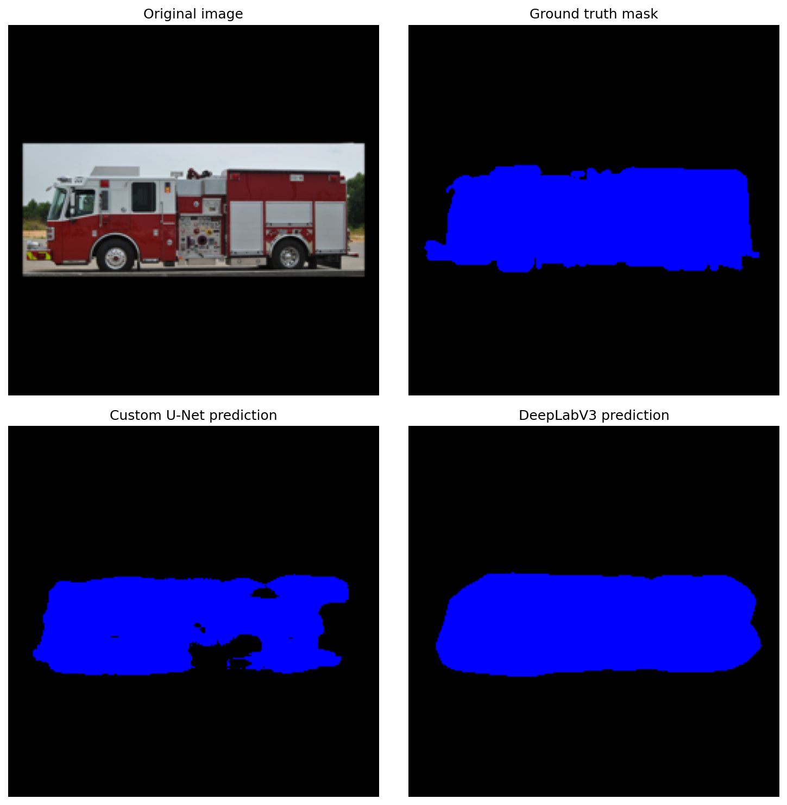

### Street scene (multiple vehicles)

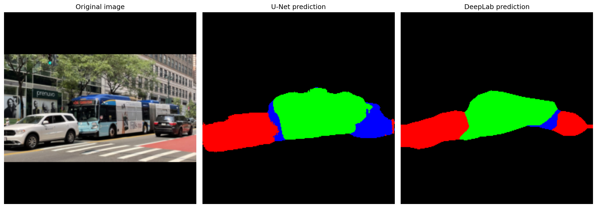

---

### Discussion

DeepLabV3 outperforms the custom Res-U-Net across all metrics, but the gap is moderate rather than dramatic.

Both models achieve very strong performance on the car class, with recall close to 0.90–0.91 and near-perfect classification among vehicle predictions (96–99% in the confusion matrix).

The main difficulty for both models is the **truck** class. In roughly half of the cases, truck pixels are predicted as cars. This indicates that the class is visually ambiguous at the chosen resolution (256x256) and not clearly separable in many images. Importantly, this issue is present even in the pretrained DeepLabV3 model, suggesting that it is not solely a limitation of the custom architecture.

The largest difference between the models appears in the **bus** class. DeepLabV3 achieves noticeably higher recall (~0.80 vs ~0.70), while Res-U-Net more often confuses buses with trucks. This suggests that pretrained features help capture higher-level structural patterns (e.g., window layout), which are harder to learn from scratch.

Overall, both models show similar error patterns. The primary limitation is not object detection itself, but the ambiguity between vehicle subclasses, combined with class imbalance in the dataset.

---

## Dataset Limitations

The OpenImages segmentation subset contains noticeable annotation noise:

- imprecise object boundaries
- missing regions
- inconsistent labeling

These issues negatively affect both training and evaluation and likely underestimate true model performance.

---

## Conclusion

The experiments show that a carefully designed U-Net architecture can approach the performance of a pretrained model.

However, pretrained architectures such as DeepLabV3 still provide a clear advantage on more complex classes due to better feature representations and generalization.
Additionally, an important observation is that the "truck" class remains ambiguous even for a pretrained model, highlighting the impact of dataset quality and class definition on segmentation performance.
