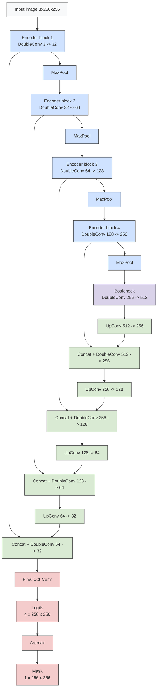

# Vehicle Segmentation (Car / Bus / Truck)

Semantic image segmentation project for Deep Learning course.

The goal is to segment vehicles in images into the following classes:

- 0 - background  
- 1 - car  
- 2 - bus  
- 3 - truck  

---

## Task

Given an input image, predict a pixel-wise segmentation mask for vehicle classes.

The dataset is based on **OpenImages instance segmentation**.

---

## Dataset

Source: [OpenImages V7](https://storage.googleapis.com/openimages/web/index.html)  
Classes:
- Car
- Bus
- Truck

### Data split

- Train: 800 images  
- Validation: 200 images  
- Test: 100 images  

---

## Model 1: Custom U-Net

A lightweight U-Net was implemented and trained from scratch.

### Architecture



---

## Model 2: Pretrained DeepLabV3

A pretrained DeepLabV3-MobileNetV3 model was fine-tuned.

---

## Results

Evaluation on 100 unseen test images from OpenImages.  
Macro metrics are computed over the selected classes (car, bus, truck), excluding background.  
Pixel accuracy is computed over all pixels, including background.  

### Overall comparison

| Model     | Pixel Acc | Car F1 | Bus F1 | Truck F1 | Macro Precision | Macro Recall | Macro F1 |
|-----------|-----------|--------|--------|----------|-----------------|--------------|----------|
| U-Net     | 0.638     | 0.330  | 0.005  | 0.105    | 0.262           | 0.215        | 0.147    |
| DeepLabV3 | 0.712     | 0.519  | 0.659  | 0.555    | 0.507           | 0.743        | 0.578    |
 
### Custom U-Net

| Class | Precision | Recall | F1-score |
|-------|-----------|--------|----------|
| Car   | 0.231 | 0.577 | 0.330 |
| Bus   | 0.309 | 0.003 | 0.005 |
| Truck | 0.247 | 0.067 | 0.105 |

| Overall Metric  | Value |
|-----------------|-------|
| Pixel Accuracy  | 0.638 |
| Macro Precision | 0.262 |
| Macro Recall    | 0.215 |
| Macro F1        | 0.147 |

### Pretrained DeepLabV3

| Class | Precision | Recall | F1-score |
|-------|-----------|--------|----------|
| Car   | 0.372 | 0.861 | 0.519 |
| Bus   | 0.533 | 0.862 | 0.659 |
| Truck | 0.615 | 0.506 | 0.555 |

| Overall Metric  | Value |
|-----------------|-------|
| Pixel Accuracy  | 0.712 |
| Macro Precision | 0.507 |
| Macro Recall    | 0.743 |
| Macro F1        | 0.578 |

---

## Run

```bash
pip install -r requirements.txt
python src/download_data.py
python src/prepare_index.py
python src/train.py
python src/train_deeplab.py
python src/evaluate.py
python src/evaluate_deeplab.py
python src/visualize_predictions.py
python src/predict_from_url.py "IMAGE_URL_OR_PATH"
```

---

## Example Prediction

Comparison of ground truth, custom U-Net, and pretrained DeepLabV3 on a test image.


---

## Conclusion

Both the custom U-Net and the pretrained DeepLabV3 models demonstrate the ability to perform pixel-wise segmentation of vehicle classes, indicating that the models successfully learned the task at a basic level.

However, the pretrained DeepLabV3 model significantly outperforms the custom U-Net across all evaluation metrics. In particular, the macro F1-score improves from 0.147 (U-Net) to 0.578 (DeepLabV3), which highlights the strong impact of transfer learning and pretrained feature representations.

Pixel accuracy is computed over all classes, including background, while macro precision, recall, and F1-score are computed only over the selected classes (car, bus, truck). This choice avoids overly optimistic evaluation results, since the background class dominates the dataset.

It is also important to note that the relatively low performance is not solely due to the limited training set (800 images), but also due to the quality of the ground truth annotations. In many images, not all vehicles are labeled, which introduces noise into both training and evaluation. As a result, correct model predictions may sometimes be penalized as errors.

Additionally, the "truck" class is defined very broadly in the dataset and includes a wide range of vehicles (e.g., heavy trucks, pickup trucks, and special machinery). In the example above, it is clear that the ground true mask is a truck, while the vehicle itself is more similar to a car, as determined by the custom UNet model and also unambiguously by the pretrained DeepLabV3 model. This ambiguity makes the classification task more difficult and contributes to lower precision and recall for this class.

Overall, the results show that while a custom model can learn basic segmentation, pretrained architectures are significantly more effective for this task, especially under conditions of limited data and imperfect annotations.

---
